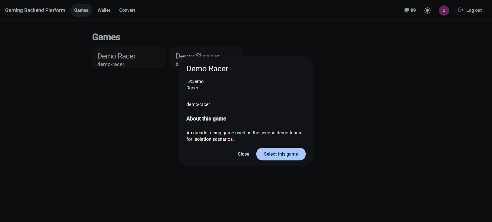
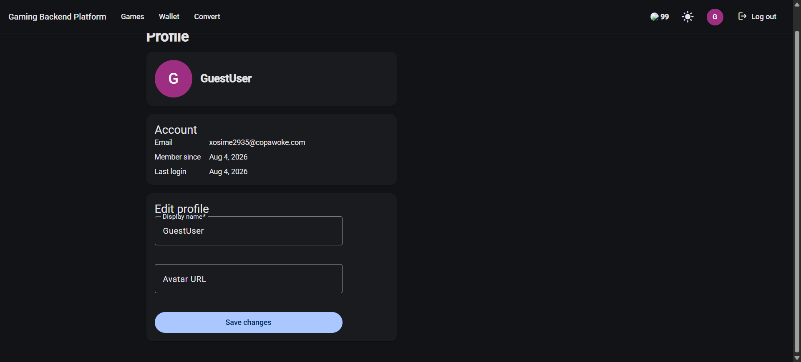
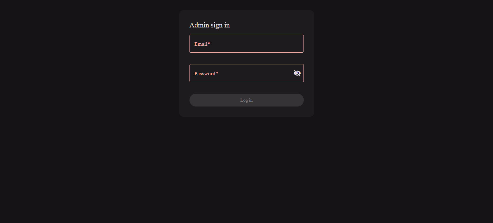
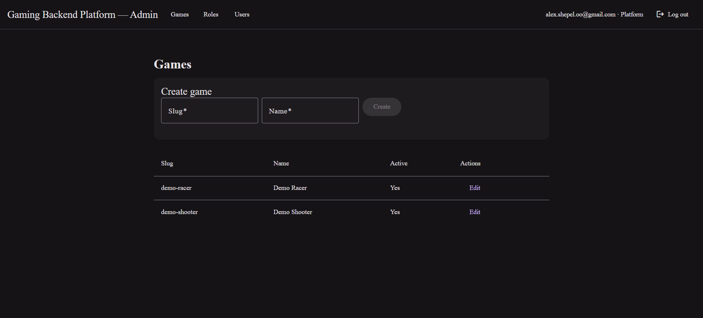
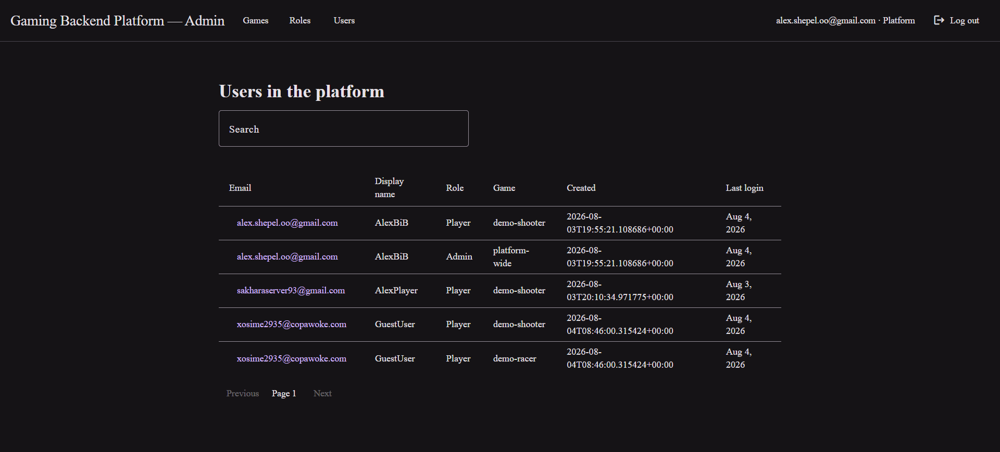
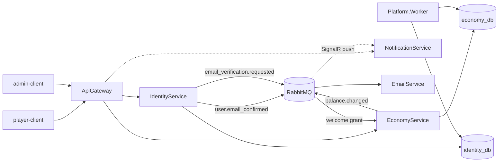

# Gaming Backend Platform

A multi-tenant backend platform for games: one shared set of services — identity, economy,
notifications — that several independent games plug into via SDK, each with its own currency,
progression, and rules, without re-implementing auth, wallets, or admin tooling per game. Built
as a portfolio project end to end, infrastructure included: Kubernetes, GitOps deployment,
distributed tracing, and structured logging, running for real on a public VPS rather than only
on `localhost`.

[](https://github.com/alex-shepel-oo/gaming-backend-platform/actions/workflows/identity-ci.yml)
[](https://github.com/alex-shepel-oo/gaming-backend-platform/actions/workflows/gateway-ci.yml)
[](https://github.com/alex-shepel-oo/gaming-backend-platform/actions/workflows/economy-ci.yml)
[](https://github.com/alex-shepel-oo/gaming-backend-platform/actions/workflows/platform-worker-ci.yml)
[](https://github.com/alex-shepel-oo/gaming-backend-platform/actions/workflows/notification-ci.yml)
[](https://github.com/alex-shepel-oo/gaming-backend-platform/actions/workflows/email-service-ci.yml)
[](https://github.com/alex-shepel-oo/gaming-backend-platform/actions/workflows/player-client-ci.yml)
[](https://github.com/alex-shepel-oo/gaming-backend-platform/actions/workflows/admin-client-ci.yml)
[](https://github.com/alex-shepel-oo/gaming-backend-platform/actions/workflows/k8s-validate.yml)
[](https://github.com/alex-shepel-oo/gaming-backend-platform/actions/workflows/gitleaks.yml)

## Contents

- [Tech stack](#tech-stack)
- [Live demo](#live-demo)
- [Architecture](#architecture)
- [CD](#cd)
- [CI](#ci)
- [Running locally](#running-locally)
- [Running on Kubernetes](#running-on-kubernetes)
- [Local automation](#local-automation)
- [Identity API](#identity-api)
- [Economy API](#economy-api)
- [NotificationService](#notificationservice)
- [Player-client (Angular)](#player-client-angular)
- [Admin-client (Angular)](#admin-client-angular)
- [Messaging](#messaging)
- [Platform.Worker](#platformworker)
- [Architecture decisions](#architecture-decisions)
- [Known limitations / what's next](#known-limitations--whats-next)

## Tech stack

| | |
|---|---|
| **Backend** |    |
| **Frontend** |  |
| **Data & messaging** |   |
| **Observability** |       |
| **Infrastructure** |      |

## Live demo

Running on a real VPS behind Cloudflare, not just locally.

| | |
|---|---|
| [shepel.dev](https://shepel.dev) | Welcome page — links to everything below, plus a short bio |
| [gbplatform.shepel.dev](https://gbplatform.shepel.dev) | Player-facing app — register a real account (email confirmation goes through a real SMTP relay) or explore as a guest: `xosime2935@copawoke.com` / `GuestUser123` |
| [gbgrafana.shepel.dev](https://gbgrafana.shepel.dev) | Observability — dashboards, traces, logs, including [live node/pod resource usage](infra/grafana/dashboards/node-resources.json) and, on the main dashboard, a query that finds real cross-service traces crossing RabbitMQ. Guest login: `viewer` / `GbpDemo2026Viewer!` (read-only) |

`gbargocd.shepel.dev` runs the real GitOps deployment behind this demo (see [CD](#cd) below) but
isn't linked with a shared login: Argo CD only enforces RBAC on write actions for
cluster/repository-level resources, so any read-only role — anonymous or a named viewer account
alike — ends up able to see cluster endpoints, repo URLs and SSH known-hosts fingerprints
regardless of policy. `gbadmin.shepel.dev` (the admin panel) similarly isn't linked with a shared
login, since it has no built-in read-only guest mode of its own and a public account would mean
real write access to live demo data, not just a view of it.

<details>
<summary>Screenshots</summary>

<details>
<summary>Player Client</summary>

### Login

Authentication screen for the player client.


### Wallet

Real-time wallet balance updates delivered through SignalR.


### Convert

Converting platform credits to a game currency, with the resulting balance update delivered through SignalR.


### Games

Game catalog and detail view.



### Profile

Player profile — account details, member-since date, and avatar.



</details>

<details>
<summary>Admin Client</summary>

### Login

Authentication screen for the admin client.



### Game Edits

Editing a game's metadata as a platform admin.



### Users

Searching users and viewing their account details.



</details>

<details>
<summary>Observability</summary>

### Dashboard - main board

Service overview dashboard under real traffic.


### Dashboard - node & pod resources

Node & pod resources dashboard under real traffic.


### Trace

A real registration trace in Explore, crossing `IdentityService → RabbitMQ → EconomyService` through the welcome-grant flow.


### Tracking by user ID

Filtering traces to everything a specific player triggered, by their `enduser.id`.


</details>

<details>
<summary>Deployment</summary>

Argo CD's resource tree after a real sync — every object this chart manages, healthy.


</details>

<details>
<summary>API</summary>

Interactive OpenAPI reference for IdentityService, served through the gateway.


</details>

</details>

> **Status:** Slice 3's backend is complete and running live in production on Kubernetes via Argo
> CD. Next up: inventory (slice 3b) and continued polish on the pieces above.

## Architecture



Every service also pushes OTLP traces and metrics to an otel-collector (not drawn above, to keep
the request-flow diagram readable) — see [CD](#cd) below for how a change actually reaches this
diagram in production, and [docs/architecture.md](docs/architecture.md) for the full breakdown,
including local-vs-Kubernetes differences and every implemented-vs-planned distinction.

## CD

Argo CD watches `main` and auto-syncs the Helm chart from
[`infra/helm/gaming-backend-platform/`](infra/helm/gaming-backend-platform/) — see
[`scripts/k8s/argocd-application-production.yaml`](scripts/k8s/argocd-application-production.yaml)
for the `Application` itself. It only reacts to `main`, never `develop` or an open PR, and only to
an actual git commit — a fresh image landing in GHCR under the same tag changes nothing about the
rendered manifest on its own.

Each service's own CI workflow ends by pointing that service's `imageTag` — in its own file under
[`image-tags/`](infra/helm/gaming-backend-platform/image-tags/), since CI is path-filtered and a
shared tag would have every service pull an image that was never rebuilt for it — at the commit
SHA it just built, then pushes that change back to `main`, the commit Argo CD's sync actually
reacts to. A push touching only `EconomyService` therefore redeploys exactly `economy-service`
(and `economy-migrator`), not the other seven images sitting untouched. Full reasoning, including
two real RBAC incidents this setup uncovered, in [ADR 0023](docs/adr/0023-gitops-argocd.md).

## CI

| Workflow | Triggers on | Checks |
|---|---|---|
| [identity-ci](.github/workflows/identity-ci.yml) | `backend/IdentityService/**`, `backend/IdentityService.Tests/**`, `backend/Directory.*.props`, `global.json` | `dotnet build` + `dotnet test`, then pushes `identity-service` to GHCR |
| [gateway-ci](.github/workflows/gateway-ci.yml) | `backend/ApiGateway/**`, `backend/ApiGateway.Tests/**`, `backend/Directory.*.props`, `global.json` | `dotnet build` + `dotnet test`, then pushes `api-gateway` to GHCR |
| [economy-ci](.github/workflows/economy-ci.yml) | `backend/EconomyService/**`, `backend/EconomyService.Tests/**`, `backend/Directory.*.props`, `global.json` | `dotnet build` + `dotnet test`, Trivy filesystem scan, pushes `economy-service` to GHCR, then Trivy image scan |
| [platform-worker-ci](.github/workflows/platform-worker-ci.yml) | `backend/Platform.Worker/**`, `backend/Platform.Worker.Tests/**`, `backend/Directory.*.props`, `global.json` | same shape as `economy-ci`, scoped to `platform-worker` |
| [notification-ci](.github/workflows/notification-ci.yml) | `backend/NotificationService/**`, `backend/NotificationService.Tests/**`, `backend/BuildingBlocks.Messaging/**`, `backend/Directory.*.props`, `global.json` | same shape as `economy-ci`, scoped to `notification-service` |
| [email-service-ci](.github/workflows/email-service-ci.yml) | `backend/EmailService/**`, `backend/EmailService.Tests/**`, `backend/Directory.*.props`, `global.json` | same shape as `economy-ci`, scoped to `email-service` |
| [player-client-ci](.github/workflows/player-client-ci.yml) | `frontend/**` | Node 22, `npm ci` + `npm run build` + `npm run test` (Vitest), Trivy filesystem scan, pushes `player-client` to GHCR, then Trivy image scan |
| [admin-client-ci](.github/workflows/admin-client-ci.yml) | `frontend/**` | Same shape as `player-client-ci`, scoped to `admin-client` |
| [k8s-validate](.github/workflows/k8s-validate.yml) | `infra/helm/**` | renders the Helm chart and validates it with `kubeconform` |
| [gitleaks](.github/workflows/gitleaks.yml) | every push/PR to `main`/`develop`, whole repository | scans the full git history (not just the diff) for committed secrets |

Path filters mean touching `backend/EconomyService/` doesn't trigger
`identity-ci`, and vice versa — each service only rebuilds and retests on the
changes that could actually affect it.

**Gitleaks results don't go to the Security tab.** It's a job-summary/PR-comment
report instead, on purpose: gitleaks scans the whole git history, so a hit
means the secret is sitting in some past commit, not just the working tree. A
Security tab alert reads as "fix the code, dismiss the alert" — the actual fix
here is rotating the leaked credential, which no code change accomplishes, so
routing it through the same UI as a code-scanning finding would be misleading.

**Trivy results do go to the Security tab** — both the dependency scan and the
image scan upload SARIF via `github/codeql-action/upload-sarif`. There's no
standalone `trivy` badge above because Trivy isn't its own workflow: it runs
as a step inside `economy-ci`, `platform-worker-ci` and `player-client-ci`
(`.github/actions/trivy-scan`), right after each one pushes its image, so
what gets scanned is the image that would actually reach the cluster.

## Running locally

```
scripts/all/deploy.sh
```

One command: `scripts/all/setup-env.sh` creates `infra/.env` from the example first (generating a
real local JWT signing key if it's still the placeholder), then brings up the whole stack — both
Postgres instances, Consul, RabbitMQ, Mailpit, IdentityService, EconomyService, Platform.Worker,
ApiGateway, player-client and admin-client. See [Local automation](#local-automation) below for
the rest of `scripts/` — this is one entry point among several, not the only thing in there.

Or the same result spelled out manually, without the script:

```
cp infra/.env.example infra/.env
cd infra
docker compose up
```

The player browser client is at `http://localhost:8080`, the admin one at
`http://localhost:8081`; anything hitting the API directly goes through the
gateway at `http://localhost:5100`. Mailpit's UI (for reading verification
emails without a real mailbox) is at `http://localhost:8025`.

Almost every value in `infra/.env.example` is committed on purpose and isn't a
production secret: the stack only binds to `localhost`, so nothing in it is
reachable from outside the machine it runs on, and every clone gets its own
`.env` by copying the example rather than sharing one committed file. The one
exception is `Jwt__PrivateKeyPem` (the RSA key IdentityService signs tokens with,
[ADR 0017](docs/adr/0017-rs256-and-jwks.md)) — that one is deliberately left as
a placeholder, not a working key, since real RSA key material is worth
committing even less than an arbitrary dummy string. Generate your own before
the first `docker compose up`; the comment above that line in `.env.example`
has the one-liner.

## Running on Kubernetes

The chart lives under `infra/helm/gaming-backend-platform/` — one Helm
release, one namespace (`gaming-platform`), the same services as the compose
stack above. `values.yaml` and `values-production.yaml` each carry only the
shape genuinely shared across every service (image defaults, ingress
structure, and so on); the per-service settings live one file per service
under `values/` and `values-production/`, plus one file per CI workflow
under `image-tags/` for the tag each deploy actually pins. See
[ADR 0021](docs/adr/0021-kubernetes-helm-migration.md) for why it's split
this way. `values-local.yaml` layers the knobs specific to the local `kind`
cluster / sandbox namespace this is actually validated against; production
is the real, currently-live deployment behind [the demo links above](#live-demo),
not a placeholder. See
[docs/architecture.md](docs/architecture.md#local-vs-kubernetes) for the full
local-vs-cluster breakdown, including why the environment is pinned to
`Development` here.

A local `kind` cluster needs Traefik as its ingress controller and a couple
of host port mappings to actually front it — `kind`'s own node image ships
neither:

```
kind create cluster --config scripts/k8s/kind-config.yaml
scripts/k8s/install-traefik.sh
```

Secrets are never committed as plaintext, but which mechanism applies depends
on whether the values are throwaway or meant to persist:

For a disposable local cluster, each service still ships a plain template
under `infra/helm/gaming-backend-platform/secrets.example/` — copy, fill in
local values, apply directly, and never check the filled-in copy in:

```
cp infra/helm/gaming-backend-platform/secrets.example/identity.yaml /tmp/identity-secrets.yaml
cp infra/helm/gaming-backend-platform/secrets.example/economy.yaml /tmp/economy-secrets.yaml
cp infra/helm/gaming-backend-platform/secrets.example/rabbitmq.yaml /tmp/rabbitmq-secrets.yaml
# edit each of the three with real values, then:
kubectl create namespace gaming-platform
kubectl apply -f /tmp/identity-secrets.yaml -f /tmp/economy-secrets.yaml -f /tmp/rabbitmq-secrets.yaml
scripts/k8s/apply.sh
```

(`scripts/k8s/up.sh` already automates exactly this for the local `kind`
cluster, generating fresh values into a scratch directory on first run —
nothing above is needed if you're just running the stack locally.)

For values meant to survive a rebuild and actually be reviewable in git —
the real deployment this eventually targets — secrets are encrypted with
[SOPS](https://github.com/getsops/sops) using `age` as the encryption
backend, not left as an unencrypted file someone has to remember to keep out
of version control. `.sops.yaml` at the repo root scopes which paths get
encrypted and with which recipient key:

```yaml
creation_rules:
  - path_regex: infra[\\/]helm[\\/]gaming-backend-platform[\\/]secrets\.enc[\\/].*\.enc\.yaml$
    encrypted_regex: ^(stringData|data)$
    age: age1kl06atlam4ngyp0x8h6d4hv58p7m6qv8xa6gnpewsa64srem9c2q65pvjc
```

`encrypted_regex` keeps only `stringData`'s values ciphertext — `apiVersion`,
`kind`, `metadata` and the `stringData` keys themselves stay legible, so a
`git diff` on one of these files still shows which secret changed even
though the value itself doesn't. The matching private key never lives in the
repo; it sits wherever `sops` looks for it by default
(`$XDG_CONFIG_HOME/sops/age/keys.txt` on Linux/macOS,
`%AppData%\sops\age\keys.txt` on Windows), generated once per operator with
`age-keygen`. Production's own keypair is generated and held the same way,
outside git — the mechanism above is exactly what the live deployment uses,
not a separate one built only to demonstrate it.

`infra/helm/gaming-backend-platform/secrets.enc/` holds the encrypted,
real-value counterparts of the five `secrets.example/` templates, committed
alongside them rather than replacing them — the plain templates remain the
"here's the shape" reference for anyone who hasn't set up an age key yet.
Encrypting a filled-in template and applying it looks like:

```
sops -e -i infra/helm/gaming-backend-platform/secrets.enc/identity.enc.yaml

sops -d infra/helm/gaming-backend-platform/secrets.enc/identity.enc.yaml      | kubectl apply -f -
sops -d infra/helm/gaming-backend-platform/secrets.enc/economy.enc.yaml       | kubectl apply -f -
sops -d infra/helm/gaming-backend-platform/secrets.enc/email-service.enc.yaml | kubectl apply -f -
sops -d infra/helm/gaming-backend-platform/secrets.enc/rabbitmq.enc.yaml      | kubectl apply -f -
sops -d infra/helm/gaming-backend-platform/secrets.enc/grafana.enc.yaml       | kubectl apply -f -
scripts/k8s/apply.sh
```

Piping `sops -d` straight into `kubectl apply -f -` means the decrypted YAML
never touches disk at all; if it does for any reason (debugging a template,
say), delete it once the apply succeeds rather than leaving it next to its
encrypted counterpart.

`gateway`, `economy-service` and `notification-service` validate tokens
against Identity's published JWKS rather than holding any signing secret of
their own — only `identity-secrets` carries the private key
([ADR 0017](docs/adr/0017-rs256-and-jwks.md)). Consul is not deployed at all
here — Kubernetes Services and kube-DNS already provide discovery (ADR 0002).

`scripts/k8s/apply.sh` is a thin `helm upgrade --install` wrapper now, not a
hand-rolled apply order: the two database StatefulSets and the
`identity-migrator`/`economy-migrator` Jobs are `pre-install`/`pre-upgrade`
Helm hooks (see `templates/statefulset.yaml` and `templates/migration-job.yaml`
in the chart), so Helm itself finishes them before any app Deployment —
including `mailpit`, `player-client` and `admin-client` — gets created. A
`Job` still has no `depends_on: condition: service_completed_successfully`
equivalent, but this is Helm's own mechanism for exactly that problem rather
than a wrapper script re-implementing `kubectl wait` by hand. The chart's
`gateway-config` ConfigMap is generated the same way the old Kustomize tree's
was: straight from `backend/ApiGateway/ocelot.Kubernetes.json`, which lives
outside the chart, so `apply.sh` passes it in with `--set-file` rather than
keeping a second copy that could drift.

Reach the stack through the Ingress, fronted by Traefik: every web-facing
service gets its own single-level `*.localhost` hostname, which every major
browser/OS resolves to `127.0.0.1` with zero setup (RFC 6761) — no
`/etc/hosts` entry needed, unlike the old path-plus-one-host layout.

| Host | Routes to |
|---|---|
| `player-client.localhost` | `player-client` (itself proxying `/api` onward to the gateway) |
| `admin-client.localhost` | `admin-client` |
| `mailpit.localhost` | Mailpit's UI (kind/sandbox only) |
| `gateway.localhost` | `api-gateway` directly — convenient for Postman/curl against the API, not something the web clients themselves need |
| `traefik.localhost` | Traefik's own dashboard (`/dashboard/`, trailing slash required) — routers, services and middleware, live |

Seeded demo accounts, all sharing the password `DemoPassword123!` (`DevelopmentSeeder`, this
password only exists on a local/sandbox cluster — never a real deployment):

| Email | Role |
|---|---|
| `admin@demo-shooter.dev` | Platform admin |
| `player.one@demo-shooter.dev`, `player.two@demo-shooter.dev` | Players, `demo-shooter` |
| `gameadmin@demo-racer.dev` | Game admin, `demo-racer` |
| `player.three@demo-racer.dev` | Player, `demo-racer` |

See [docs/architecture.md](docs/architecture.md#local-vs-kubernetes) for why
player-client's own Nginx does the `/api` proxying rather than a second
Ingress rule. Or port-forward directly:

```
kubectl -n gaming-platform port-forward svc/player-client 8080:8080
kubectl -n gaming-platform port-forward svc/admin-client 8081:8081
kubectl -n gaming-platform port-forward svc/api-gateway 5100:5100
kubectl -n gaming-platform port-forward svc/mailpit 8025:8025   # kind/sandbox only
```

## Local automation

`scripts/` mirrors the CI steps above for local use — each script calls the
same commands its corresponding workflow does, rather than a parallel set of
commands that could quietly drift from what CI actually checks.

```
scripts/
├── backend/
│   ├── build.sh    # dotnet build backend/GamingBackendPlatform.slnx
│   ├── test.sh     # dotnet test backend/GamingBackendPlatform.slnx
│   └── deploy.sh   # docker compose up -d, every backend service, no player-client
├── frontend/
│   ├── build.sh    # npm ci && npm run build (shared, then player-client)
│   ├── test.sh     # npm run test (Vitest, both projects)
│   └── deploy.sh   # docker compose up -d player-client
├── all/
│   ├── setup-env.sh # idempotent: creates infra/.env from the example and fills in
│   │                 # a real local signing key if it's still the placeholder --
│   │                 # every deploy.sh below calls this first
│   ├── verify.sh   # backend build+test, then frontend build+test -- no deploy
│   ├── deploy.sh   # docker compose up -d, the whole stack
│   ├── ci.sh       # verify.sh, then deploy.sh
│   └── stop.sh     # docker compose down (--clean also drops volumes and prunes images)
└── k8s/
    ├── kind-config.yaml           # kind cluster config: host port mappings for Traefik
    ├── install-traefik.sh         # one-time cluster addon install (see above)
    ├── traefik-values-local.yaml  # values for the official Traefik chart on kind
    ├── apply.sh                   # helm upgrade --install the chart (see above)
    └── teardown.sh                # kind delete cluster --name gbp
```

**`verify.sh` vs `ci.sh`:** `verify.sh` is the quick local gate — build and
test both sides and stop there, nothing gets deployed afterward. `ci.sh` is
`verify.sh` plus a full-stack deploy at the end, for when the goal is a
running stack, not just confirmation that everything builds and passes.

## Identity API

Auth, sessions, profile, and the platform's tenant registry, plus the permission-based RBAC model
every role runs on: a role is a named, editable set of permissions resolved fresh at login/refresh
time, not a fixed enum ([ADR 0013](docs/adr/0013-permission-based-rbac-and-audience-scoped-tokens.md)),
with cookie-based refresh for browser clients ([ADR 0011](docs/adr/0011-web-auth-cookie-flow.md)),
RS256 + JWKS signing ([ADR 0017](docs/adr/0017-rs256-and-jwks.md)), and an admin surface gated on a
separate token audience ([ADR 0016](docs/adr/0016-admin-surface-isolation.md)). Full endpoint
reference, both walkthroughs, and the RBAC catalog/claims/anti-escalation details:
**[docs/api/identity.md](docs/api/identity.md)**.

## Economy API

Wallets, ledger transactions, and platform-to-game currency conversion, direct at
`http://localhost:5001` and partly proxied through the gateway. Runs on NUnit rather than
IdentityService's xUnit, on purpose, to show working knowledge of both. Full endpoint reference,
the reasoning behind returning `402` for insufficient funds, and the conversion saga's
compare-and-swap design: **[docs/api/economy.md](docs/api/economy.md)**.

## NotificationService

Turns `BalanceChanged` events into a live SignalR push to whichever browser tab is connected —
port 5003, no database, no backplane (single replica is this slice's accepted scale). The hub
isn't reachable through Ocelot (a measured WebSocket-upgrade failure, not an assumption), so each
frontend's own Nginx proxies `/hubs` directly. Full endpoint reference and the `IUserIdProvider`
gap that would otherwise make deliveries silently vanish: **[docs/services/notification-service.md](docs/services/notification-service.md)**.

## Player-client (Angular)

The platform's first browser client — Login, Games, Wallet, Convert, Profile, password reset —
built on Angular 22 under `frontend/`. Keeps the access token in memory only, relies on the
`gbp_refresh` httpOnly cookie for silent refresh, and treats route guards as UX rather than a
security boundary ([ADR 0012](docs/adr/0012-frontend-security-and-guards.md)). Build/run commands,
the cookie flow in detail, and the CORS setup: **[docs/services/player-client.md](docs/services/player-client.md)**.

## Admin-client (Angular)

A second Angular app, same `shared` library, covering platform and game admin/moderator tooling on
its own audience-gated surface ([ADR 0016](docs/adr/0016-admin-surface-isolation.md)) — one app,
not two, with platform-wide and game-scoped sections both gated by permission. Build/run commands,
the game-picker login flow, and the screen-by-screen breakdown:
**[docs/services/admin-client.md](docs/services/admin-client.md)**.

## Messaging

The transactional outbox/inbox mechanism every publisher and consumer in the system shares
(`BuildingBlocks.Messaging`) — at-least-once delivery, topic-exchange topology, inbox-lite
deduplication, and the welcome-grant flow that made it the first cross-service event binding in
the platform. Full flow, delivery guarantees, and known limitations: **[docs/messaging.md](docs/messaging.md)**.

## Platform.Worker

A separate Quartz-scheduled project for operational housekeeping, rather
than a timer bolted onto each service. It runs one job today,
`CleanupExpiredTokensJob`, on a 15-minute schedule:

- **identity_db:** deletes expired or already-revoked `refresh_token_families`
  (which cascades to their `refresh_tokens` at the database FK level) and
  expired `email_verification_codes`.
- **economy_db:** deletes `outbox_messages` rows that have been dispatched
  (`processed_at` set) and are older than a 7-day retention window. Rows
  still waiting to be dispatched (`processed_at IS NULL`) are never touched.

Both thresholds are configurable (`CleanupJob__IntervalMinutes`,
`CleanupJob__OutboxRetentionDays` in `infra/.env`).

**Why one worker reads two databases.** This is the one place in the system
that opens connections to both `identity_db` and `economy_db` at once, which
is a named exception to [ADR 0001](docs/adr/0001-database-per-service.md)'s
database-per-service boundary, not an oversight of it. The distinction the
exception rests on: this job never reads either database to serve a
request, only to delete rows each owning service already considers dead, by
that service's own rules. It does so through narrow, cleanup-only
`DbContext`s scoped to just the columns it deletes by, not the full
`IdentityDbContext`/`EconomyDbContext` models.

## Architecture decisions
[docs/adr/](docs/adr/).

## Known limitations / what's next

- Gateway routing tests (a WireMock stub standing in for IdentityService,
  asserting the gateway itself rejects unauthenticated requests before they
  reach a downstream service) were left out of this slice; `OcelotConfigurationTests`
  covers the static configuration instead. This is the honest gap rather than
  a broken or skipped test.
  - Access token revocation has a bounded window: revoking a session via
  `revoke-sessions` does not deny-list the access tokens already issued
  under it, since their `jti`s were never recorded at issue time. A revoked
  session's access token stays valid for up to its own 15-minute lifetime.
  See ADR 0008.
- A permission change to `role_permissions` isn't instant: the caller keeps
  the `perms` an already-issued access token carries until their next
  refresh (bounded by that token's own lifetime, ≤15 minutes). Forcing an
  immediate cutoff still means `revoke-sessions`, same as above but for a
  different reason - one caps how long a *revoked* session's token stays
  valid, this one caps how stale a *still-valid* session's permissions can
  get. See [ADR 0013](docs/adr/0013-permission-based-rbac-and-audience-scoped-tokens.md).
- The game registry (`games` table) lives inside IdentityService's own
  database. It conceptually belongs to a platform-level service, which
  does not exist yet at this stage of the build. See ADR 0005.
- No refresh grace window: a client that loses the network response to a
  legitimate `/refresh` call and retries with the same (now-consumed)
  token is treated as reuse and loses the whole session, not just that
  request. See ADR 0008.
- `external_logins` is schema only — no OAuth provider (Google, Discord, etc.)
  is actually wired up yet, and there's no account-linking policy implemented
  either. See ADR 0015.
- Rate limits on login/register/confirm/resend are enforced per gateway
  replica, not per cluster — the deployment scales to ten replicas, so the
  effective budget is the configured limit times whichever replica count
  is currently running. The per-account cooldown on resend is the
  exception: it is enforced in the database and holds regardless of
  replica count.
- `Platform.Worker`'s cleanup job connects to both `identity_db` and
  `economy_db`, a named exception to [ADR 0001](docs/adr/0001-database-per-service.md)'s
  database-per-service boundary made for housekeeping only — it never reads
  either database to serve a request, only to delete rows each owning
  service already considers dead.
- The web cookie flow needs the browser to see its frontend and the API as
  one origin, which is what lets the refresh cookie use `SameSite=Strict`
  with no CSRF token. That no longer means a single shared origin for the
  whole platform: `admin-client` is a genuinely separate frontend, on its
  own host and port, and still gets a clean `SameSite=Strict` cookie,
  because its own Nginx reverse-proxies `/api` onto itself the same way
  `player-client`'s does — the browser never makes a cross-origin call
  either way. See ADR 0011 and
  [ADR 0016](docs/adr/0016-admin-surface-isolation.md).
- A true backend-for-frontend — one where the server itself holds the
  tokens, not just a reverse proxy that keeps the browser same-origin with
  its own frontend — would keep even more token handling out of the browser
  than the cookie-only approach both clients use today. `admin-client`'s own
  origin doesn't do this: the access token still lives in browser memory and
  the refresh cookie still goes straight through the proxy to
  IdentityService, so that gap is unchanged, just now shared by two
  frontends instead of one.
- The conversion saga is in-process and sequential, not cross-service
  choreography over the message bus — a second service reacting to an
  event mid-saga needs InventoryService, which doesn't exist until slice 3.
  See [ADR 0010's addendum](docs/adr/0010-transactional-outbox-event-bus.md#addendum-the-conversion-saga).
- The deduplicating consumer's inbox is inbox-lite: `message_id` and
  `processed_at`, nothing more. No per-message retry bookkeeping or
  metadata — that's the full inbox pattern, still Extended scope.
- Kubernetes Secrets are plain `Secret` objects applied from the
  `secrets.example/*.yaml` templates, not sourced from an external secrets
  manager, and deliberately kept outside the Helm release itself so an
  `upgrade` never touches them. Something like Sealed Secrets came up as the
  natural next step here and wasn't built in this group.
- RabbitMQ and both Postgres instances run as dev/sandbox-only images
  (`rabbitmq:4-management-alpine`, `postgres:17-alpine`) in every environment
  this repo currently deploys to. A production target would point at managed
  instances of both instead.