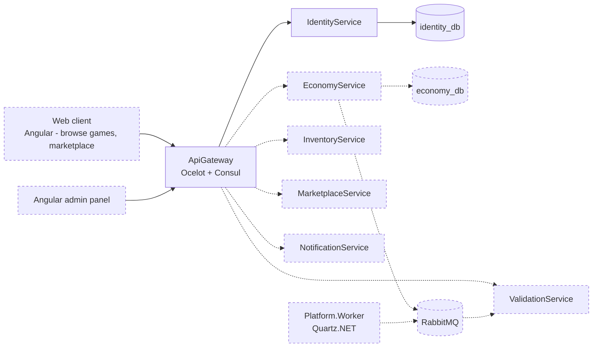

# Architecture

Solid lines — implemented. Dashed lines — designed and scheduled for implementation in future iterations.

> The platform is designed to support native game clients (Unity, etc.) connecting
> through an SDK — that integration is deferred, possibly indefinitely. The near-term
> priority is a web client and an admin panel, so the platform's functionality
> (games, marketplace, economy) is fully explorable from a browser without needing
> a game client at all.

## Currently implemented

- **Multi-tenant identity**: global accounts (one email, one password across every
  game on the platform), roles and sessions scoped per game via `GameId`. See ADR 0005.
- **Token strategy**: short-lived (15 min) access tokens, refresh tokens rotating
  through single-use families with reuse detection — presenting an already-consumed
  refresh token revokes the entire session, not just that token. See ADR 0008.
- **Email confirmation flow**: one-time 6-digit codes, BCrypt-hashed, with anti-
  enumeration guarantees on both `confirm-email` and `resend-verification` — every
  failure path returns an identical response regardless of the real reason. See ADR 0009.
- **Authorization**: `Policies.Player` / `ModeratorOrAbove` / `Admin`, enforced in
  IdentityService itself as well as at the gateway. This is defence in depth, not
  duplicated logic by oversight — a service trusting the gateway's check alone is
  one routing mistake from being open.
- **Rate limiting**: in-process IP limits on login/register/confirm/resend as a
  first line, plus a database-backed per-account cooldown on resend that stays
  authoritative regardless of how many gateway/service replicas are running.

## Local vs Kubernetes

Both run the same images; only how services find each other and where
configuration comes from differs.

| | docker-compose (`infra/docker-compose.yml`) | Kubernetes (`infra/kubernetes/`) |
|---|---|---|
| Service discovery | Consul (`ServiceDiscoveryProvider: Consul` + `ServiceName` in `ocelot.Development.json`) | None deployed — Kubernetes Services and kube-DNS already resolve `identity-service.gaming-platform.svc.cluster.local`; `ocelot.Kubernetes.json` uses that host directly. Running Consul here too would be a second system answering a question Kubernetes already answers. See ADR 0002 |
| Postgres | Single container, no replicas | `identity-db` StatefulSet with a PVC via `volumeClaimTemplates` — stable identity and one writer, not a Deployment (see the commit that added it). Dev/sandbox only; production points at a managed instance |
| Configuration | `.env` (committed as `.env.example`, localhost-only so it's not a real secret) | Split: non-secret values in ConfigMaps (`base/01-configmap.yaml` for what identity-service and the gateway share, plus one ConfigMap per service), the signing key / database connection string / SMTP password in a Secret. Only `identity/secret.example.yaml` is committed, with placeholder values — the real Secret is applied directly and never lands in git |
| Mailpit | Always present (`mailpit` service) | Only in local kind clusters and the sandbox namespace (`infra/kubernetes/mailpit/`). The production namespace never gets this manifest; `Email__Smtp__Host` there points at the real relay |
| JWT signing key | Same value in both services' `Jwt__Key` env var, from the shared `.env` | Both `identity-service` and `gateway` read `Jwt__Key` from the same `identity-secrets` Secret, so the two can't drift apart on what a valid token looks like |

Namespace is `gaming-platform`. Files under `base/` carry numeric prefixes
(`00-namespace.yaml`, `01-configmap.yaml`) so `kubectl apply -f base/` — which
applies a directory's files in alphabetical order within one call — creates
the namespace before anything that lives in it, regardless of how apply is
invoked.

## Cross-cutting

- **Multi-tenancy**: `GameId` is a first-class property across schemas and events —
  present in JWT claims, refresh token families, and role assignments, even where
  (as with `User` itself) it deliberately isn't on the entity directly. See ADR 0005.
- **Event bus**: RabbitMQ, choreography-based saga — planned for the
  Economy/Inventory/Marketplace slice, not yet implemented.
- **Observability**: correlation ID propagation (`X-Correlation-Id`, generated if
  absent, pushed into the Serilog log context for the life of the request) and
  structured logging via Serilog, writing to stdout only.

## Path-filtered CI

Each service's GitHub Actions workflow triggers on changes to its own folder plus
`backend/Directory.*.props` and `global.json` — a version bump in central package
management affects every service, not just the one whose folder changed.
`k8s-validate` runs independently of branch, on any change under
`infra/kubernetes/**`, so manifest changes are checked regardless of which branch
they land on.

## Cleanup jobs (Platform.Worker)

Not implemented in this slice. When `Platform.Worker` exists, a scheduled Quartz.NET
job removes, in batches to avoid long-held transactions:

- expired or revoked `refresh_tokens` and `refresh_token_families`
- expired `revoked_access_tokens`
- `email_verification_codes` past their TTL, or more than 24 hours after consumption

See ADR 0008 and ADR 0009 for why these tables accumulate rows that nothing else
cleans up yet.