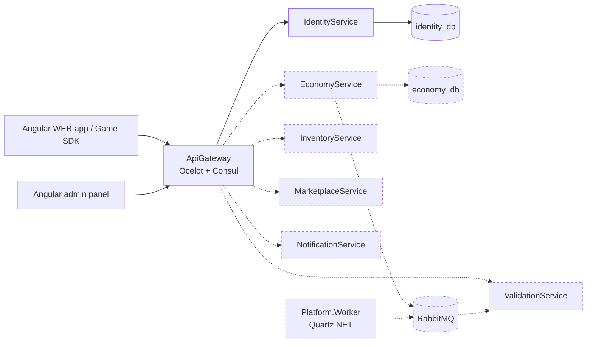

# Architecture

Solid lines — implemented. Dashed lines — designed and scheduled for implementation in future iterations.

## Currently implemented
- Authorization: `Policies.Player` / `ModeratorOrAbove` / `Admin`, enforced in IdentityService
  itself as well as later at the gateway. This is defence in depth, not duplicated logic by
  oversight — a service trusting the gateway's check alone is one routing mistake from being open.

## Local vs Kubernetes

Both run the same images; only how services find each other and where
configuration comes from differs.

| | docker-compose (`infra/docker-compose.yml`) | Kubernetes (`infra/kubernetes/`) |
|---|---|---|
| Service discovery | Consul (`ServiceDiscoveryProvider: Consul` + `ServiceName` in `ocelot.Development.json`) | None deployed — Kubernetes Services and kube-DNS already resolve `identity-service.gaming-platform.svc.cluster.local`; `ocelot.Kubernetes.json` uses that host directly. Running Consul here too would be a second system answering a question Kubernetes already answers. See ADR 0002 |
| Postgres | Single container, no replicas | `identity-db` StatefulSet with a PVC via `volumeClaimTemplates` — stable identity and one writer, not a Deployment (see the commit that added it). Dev/sandbox only; production points at a managed instance |
| Configuration | `.env` (committed as `.env.example`, localhost-only so it's not a real secret) | Split: non-secret values in ConfigMaps (`base/01-configmap.yaml` for what identity-service and the gateway share, plus one ConfigMap per service), the signing key / database connection string / SMTP password in a Secret. Only `identity/secret.example.yaml` is committed, with placeholder values — the real Secret is applied directly and never lands in git |
| Mailpit | Always present (`mailpit` service) | Only in local kind clusters and the sandbox namespace (`infra/kubernetes/mailpit/`). The production namespace never gets this manifest; `Email__Smtp__Host` there points at the real relay |
| JWT signing key | Same value in both services' `Jwt__Key` env var, from the shared `.env` | Both `identity-service` and `gateway` read `Jwt__Key` from the same `identity-secrets` Secret, so the two can't drift apart on what a valid token looks like |

Namespace is `gaming-platform`. Files under `base/` carry numeric prefixes
(`00-namespace.yaml`, `01-configmap.yaml`) so `kubectl apply -f base/` — which
applies a directory's files in alphabetical order within one call — creates
the namespace before anything that lives in it, regardless of how apply is
invoked.

## Cross-cutting
- Multi-tenancy: GameId is a first-class property across schemas and events.
- Event bus: RabbitMQ, choreography-based saga
- Observability: correlation ID + Serilog

## Path-filtered CI

## Cleanup jobs (Platform.Worker)