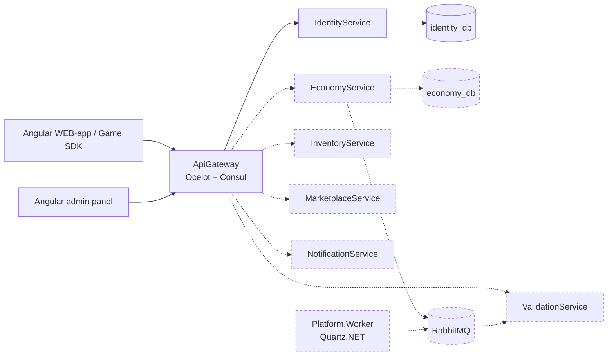

# Architecture

Solid lines — implemented. Dashed lines — designed and scheduled for implementation in future iterations.

## Currently implemented
-

## Cross-cutting
- Multi-tenancy: GameId is a first-class property across schemas and events.
- Event bus: RabbitMQ, choreography-based saga
- Observability: correlation ID + Serilog

## Path-filtered CI

## Cleanup jobs (Platform.Worker)