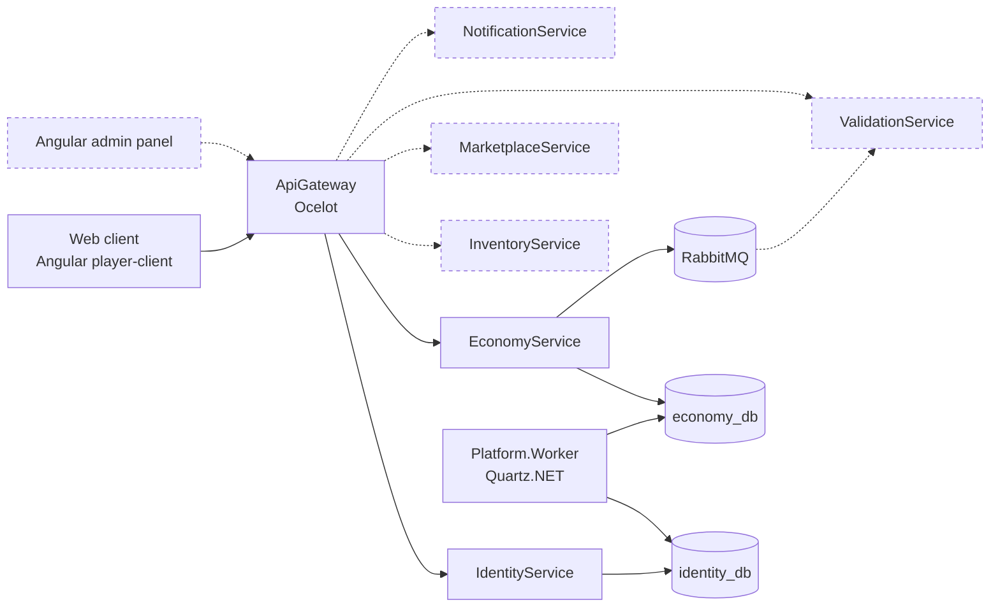

# Architecture

Solid lines — implemented. Dashed lines — designed and scheduled for implementation in future iterations.

> The platform is designed to support native game clients (Unity, etc.) connecting
> through an SDK — that integration is deferred, possibly indefinitely. The near-term
> priority is a web client and an admin panel, so the platform's functionality
> (games, marketplace, economy) is fully explorable from a browser without needing
> a game client at all.

## Currently implemented

- **Multi-tenant identity**: global accounts (one email, one password across every
  game on the platform), roles and sessions scoped per game via `GameId`. See ADR 0005.
- **Token strategy**: short-lived (15 min) access tokens, refresh tokens rotating
  through single-use families with reuse detection — presenting an already-consumed
  refresh token revokes the entire session, not just that token. See ADR 0008.
- **Email confirmation flow**: one-time 6-digit codes, BCrypt-hashed, with anti-
  enumeration guarantees on both `confirm-email` and `resend-verification` — every
  failure path returns an identical response regardless of the real reason. See ADR 0009.
- **Authorization**: `Policies.Player` / `ModeratorOrAbove` / `Admin`, enforced in
  IdentityService itself as well as at the gateway. This is defence in depth, not
  duplicated logic by oversight — a service trusting the gateway's check alone is
  one routing mistake from being open.
- **Rate limiting**: in-process IP limits on login/register/confirm/resend as a
  first line, plus a database-backed per-account cooldown on resend that stays
  authoritative regardless of how many gateway/service replicas are running.

## Local vs Kubernetes

Both run the same images; only how services find each other, where
configuration comes from, and how many replicas of each exist differs.

The Kubernetes side now mirrors the full compose stack: `identity-db`,
`identity-service`, `economy-db`, `rabbitmq`, `economy-service`,
`platform-worker`, `player-client`, `api-gateway`, plus `mailpit` in
non-production namespaces. Consul is the one piece that has no Kubernetes
counterpart at all — see the service discovery row below.

| | docker-compose (`infra/docker-compose.yml`) | Kubernetes (`infra/kubernetes/`) |
|---|---|---|
| Service discovery | Consul (`ServiceDiscoveryProvider: Consul` + `ServiceName` in `ocelot.Development.json`) | None deployed — Kubernetes Services and kube-DNS already resolve names like `identity-service.gaming-platform.svc.cluster.local`; `ocelot.Kubernetes.json` uses those directly. Running Consul here too would be a second system answering a question Kubernetes already answers. See ADR 0002 |
| `identity_db` / `economy_db` | Single Postgres container each, no replicas | `identity-db` / `economy-db` StatefulSets, each with its own PVC via `volumeClaimTemplates` — stable pod identity and a single writer, not a Deployment. Dev/sandbox only; production points at managed instances |
| RabbitMQ | Single container, no volume | `rabbitmq` StatefulSet + PVC (`rabbitmq:4-management-alpine`). The outbox dispatcher (ADR 0010) hands a message to the broker and then marks its own outbox row processed; a pod recreated between those two points with no volume loses exactly the message the outbox table already believes was delivered. Same dev/sandbox-only caveat as the databases above — production would use a managed broker |
| Database migrations | `identity-migrator` / `economy-migrator` one-shot containers, ordered via `depends_on: condition: service_completed_successfully` | Kubernetes `Job`s (`identity-migrator` / `economy-migrator`), not an initContainer and not folded into the service Deployment — a Job is the object whose `backoffLimit`/completion semantics actually mean "run once to completion, then stop," which neither an initContainer (tied to one pod's lifecycle) nor a Deployment (expects a long-running process) give for free. `scripts/k8s-apply.sh` applies the two database StatefulSets, waits on `rollout status`, applies the two migration Jobs, waits on `kubectl wait --for=condition=complete`, and only then renders and applies everything else — the same ordering compose gets for free from `service_completed_successfully`, spelled out by hand because a Job has no `depends_on` equivalent |
| Configuration | `.env` (committed as `.env.example`, localhost-only so it's not a real secret) | Non-secret values in ConfigMaps (`base/01-configmap.yaml` shared, plus one ConfigMap per service); signing keys, connection strings and broker credentials in Secrets. Only the `*.secret.example.yaml` templates are committed, with placeholder values — the real Secret is applied directly and never lands in git |
| `ASPNETCORE_ENVIRONMENT` | `Development` | `Development` on every service's ConfigMap, not `Production` — this cluster is a local demo/sandbox target (clone the repo, stand up a kind cluster, no cloud credentials involved), and `Development` is what actually turns on the existing `DevelopmentSeeder`s for a working demo. **Known limitation:** a real Azure production target still needs its own decision about environment and seeding once that work starts — this branch doesn't make that call |
| Mailpit | Always present (`mailpit` service) | Only in local kind clusters and the sandbox namespace (`infra/kubernetes/mailpit/`). The production namespace never gets this manifest; `Email__Smtp__Host` there points at the real relay |
| JWT signing key | Same value in `identity-service`'s and `api-gateway`'s `Jwt__Key`, from the shared `.env` | `identity-service`, `gateway` and `economy-service` all read `Jwt__Key` from the same `identity-secrets` Secret rather than each holding a copy — one source of truth, so rotating the key can't update two of the three and silently miss the other |
| Platform.Worker | Single container, no scaling knob | Deployment with `replicas: 1`, and **no HPA object exists for it at all** — not an HPA capped at `maxReplicas: 1` (that would still let scale events fire), the manifest is simply absent. Quartz here runs its default, non-clustered `JobStore`; a second replica would run `CleanupExpiredTokensJob` from two pods with no coordination between them, unlike the outbox dispatcher, which `SELECT ... FOR UPDATE SKIP LOCKED` protects against the same class of problem. **Known limitation:** real horizontal scaling of the worker needs a clustered `AdoJobStore`, not built here |
| player-client / Ingress | player-client's own Nginx proxies `/api/*` to `api-gateway` over the compose network, so the browser and the API share the `:8080` origin — what lets the refresh cookie use `SameSite=Strict` (ADR 0011) | The Ingress has exactly one rule: `/` → the `player-client` Service. There's no second rule sending `/api` straight to `api-gateway` — that would duplicate the same-origin decision in two places (Ingress rules and `nginx.conf`) that could quietly drift apart later. player-client's Nginx does the identical `/api` proxy it does in compose, just resolving `api-gateway` through kube-DNS instead of a compose service name — one mechanism, one place, for both topologies. See ADR 0011 / ADR 0012 |
| Gateway routing config | `ocelot.Development.json`, Consul-based `ServiceName` routing | `ocelot.Kubernetes.json`, static `DownstreamHostAndPorts` pointing at `*.svc.cluster.local` names. `gateway/kustomization.yaml`'s `configMapGenerator` builds the `gateway-config` ConfigMap directly from `backend/ApiGateway/ocelot.Kubernetes.json` instead of a hand-copied inline block — this file drifted from a manually maintained ConfigMap twice during this group before the switch, so generation removes that whole class of mistake. That source file lives outside `infra/kubernetes/gateway/`, and `kubectl apply -k` has no flag to let Kustomize read outside the kustomization's own directory (only the separate `kubectl kustomize` render subcommand does) — so `scripts/k8s-apply.sh` renders with `kubectl kustomize --load-restrictor=LoadRestrictionsNone` and pipes the result into `kubectl apply -f -`, rather than a bare `kubectl apply -k` |
| Image pull policy | n/a — images are built locally and used directly | `imagePullPolicy: IfNotPresent` on every locally-built image (`identity-service`, `economy-service`, `api-gateway`, `platform-worker`, `player-client`, and both migrator Jobs). All of them are tagged `:latest`, which Kubernetes otherwise defaults to `imagePullPolicy: Always` for — that tries a registry pull on every pod start, which fails on a kind cluster with no registry access. Third-party images (`postgres`, `rabbitmq`, `mailpit`) are left on their own default; only the images this repo builds need the override |

Namespace is `gaming-platform`. Files under `base/` carry numeric prefixes
(`00-namespace.yaml`, `01-configmap.yaml`) so `kubectl apply -f base/` — which
applies a directory's files in alphabetical order within one call — creates
the namespace before anything that lives in it, regardless of how apply is
invoked.

## Cross-cutting

- **Multi-tenancy**: `GameId` is a first-class property across schemas and events —
  present in JWT claims, refresh token families, and role assignments, even where
  (as with `User` itself) it deliberately isn't on the entity directly. See ADR 0005.
- **Event bus**: RabbitMQ, choreography-based saga — planned for the
  Economy/Inventory/Marketplace slice, not yet implemented.
- **Observability**: correlation ID propagation (`X-Correlation-Id`, generated if
  absent, pushed into the Serilog log context for the life of the request) and
  structured logging via Serilog, writing to stdout only.

## Path-filtered CI

Each service's GitHub Actions workflow triggers on changes to its own folder plus
`backend/Directory.*.props` and `global.json` — a version bump in central package
management affects every service, not just the one whose folder changed.
`k8s-validate` runs independently of branch, on any change under
`infra/kubernetes/**`, so manifest changes are checked regardless of which branch
they land on.

## Cleanup jobs (Platform.Worker)

Implemented. See the [README's Platform.Worker section](../README.md#platformworker)
for the job list, the tables it touches in `identity_db` and `economy_db`, and
the database-per-service exception it relies on. In Kubernetes it runs as its
own Deployment, pinned to a single replica — see the
[Local vs Kubernetes](#local-vs-kubernetes) table above for why.