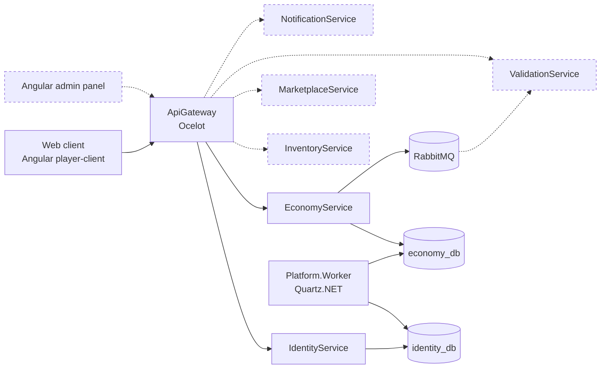

# Architecture

Solid lines — implemented. Dashed lines — designed and scheduled for implementation in future iterations.

> The platform is designed to support native game clients (Unity, etc.) connecting
> through an SDK — that integration is deferred, possibly indefinitely. The near-term
> priority is a web client and an admin panel, so the platform's functionality
> (games, marketplace, economy) is fully explorable from a browser without needing
> a game client at all.

## Currently implemented

- **Multi-tenant identity**: global accounts (one email, one password across every
  game on the platform), roles and sessions scoped per game via `GameId`. See ADR 0005.
- **Token strategy**: short-lived (15 min) access tokens, refresh tokens rotating
  through single-use families with reuse detection — presenting an already-consumed
  refresh token revokes the entire session, not just that token. See ADR 0008.
- **Email confirmation flow**: one-time 6-digit codes, BCrypt-hashed, with anti-
  enumeration guarantees on both `confirm-email` and `resend-verification` — every
  failure path returns an identical response regardless of the real reason. See ADR 0009.
- **Authorization**: `Policies.Player` / `ModeratorOrAbove` / `Admin`, enforced in
  IdentityService itself as well as at the gateway. This is defence in depth, not
  duplicated logic by oversight — a service trusting the gateway's check alone is
  one routing mistake from being open.
- **Rate limiting**: in-process IP limits on login/register/confirm/resend as a
  first line, plus a database-backed per-account cooldown on resend that stays
  authoritative regardless of how many gateway/service replicas are running.

## Local vs Kubernetes

Both run the same images; only how services find each other, where configuration comes from, and
how many replicas of each exist differs. The biggest differences:

- **Service discovery**: Consul locally (`ocelot.Development.json`'s `ServiceName` routing) vs.
  nothing deployed in Kubernetes — kube-DNS already resolves service names, so `ocelot.Kubernetes.json`
  uses those directly rather than running a second system to answer a question Kubernetes already
  answers. See [ADR 0002](adr/0002-api-gateway-ocelot-consul.md).
- **Stateful services** (Postgres × 2, RabbitMQ) run as plain containers locally; in Kubernetes they're
  StatefulSets with their own PVCs — stable identity and a single writer, not a Deployment.
- **Secrets**: a local `.env` file vs. Kubernetes Secrets, with only placeholder `secrets.example/*.yaml`
  templates committed — the real Secret is applied directly and never enters git.
- **Migrations** run as one-shot containers locally, and as `pre-install`/`pre-upgrade` Helm-hook Jobs
  in Kubernetes, ordered ahead of the app Deployments the same way compose's
  `service_completed_successfully` orders them.

The full comparison — every row, including JWT key sourcing, `Platform.Worker`'s scaling posture,
Ingress routing, and the observability stack's deployment state — lives in
[Backend deployment topology](architecture/backend.md).

## Cross-cutting

- **Multi-tenancy**: `GameId` is a first-class property across schemas and events —
  present in JWT claims, refresh token families, and role assignments, even where
  (as with `User` itself) it deliberately isn't on the entity directly. See ADR 0005.
- **Event bus**: RabbitMQ, choreography-based saga — planned for the
  Economy/Inventory/Marketplace slice, not yet implemented.
- **Observability**: OpenTelemetry across every backend service plus both frontend apps (Grafana
  Faro), one connected trace spanning synchronous requests and the async outbox → RabbitMQ path,
  tagged with a shared `enduser.id` for player-level filtering. Full architecture, retention
  settings, and a real end-to-end trace walkthrough: [Observability overview](observability/overview.md).

## Path-filtered CI

Each service's GitHub Actions workflow triggers on changes to its own folder plus
`backend/Directory.*.props` and `global.json` — a version bump in central package
management affects every service, not just the one whose folder changed.
`k8s-validate` runs independently of branch, on any change under
`infra/helm/**`, so chart changes are checked regardless of which branch
they land on.

## Related documentation

- [Backend deployment topology](architecture/backend.md) — the full compose-vs-Kubernetes comparison
- [Frontend architecture](architecture/frontend.md)
- [Data ownership](architecture/data.md)
- [Business/technical flows](architecture/flows.md)
- [Security overview](security/overview.md)
- [Observability overview](observability/overview.md)
- [Architecture decisions](adr/README.md)

## Cleanup jobs (Platform.Worker)

Implemented. See the [README's Platform.Worker section](../README.md#platformworker)
for the job list, the tables it touches in `identity_db` and `economy_db`, and
the database-per-service exception it relies on. In Kubernetes it runs as its
own Deployment, pinned to a single replica with no HPA — see the
[Platform.Worker row](architecture/backend.md) in the deployment topology doc for why.