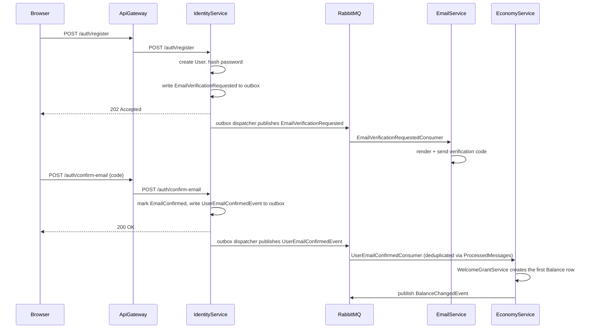
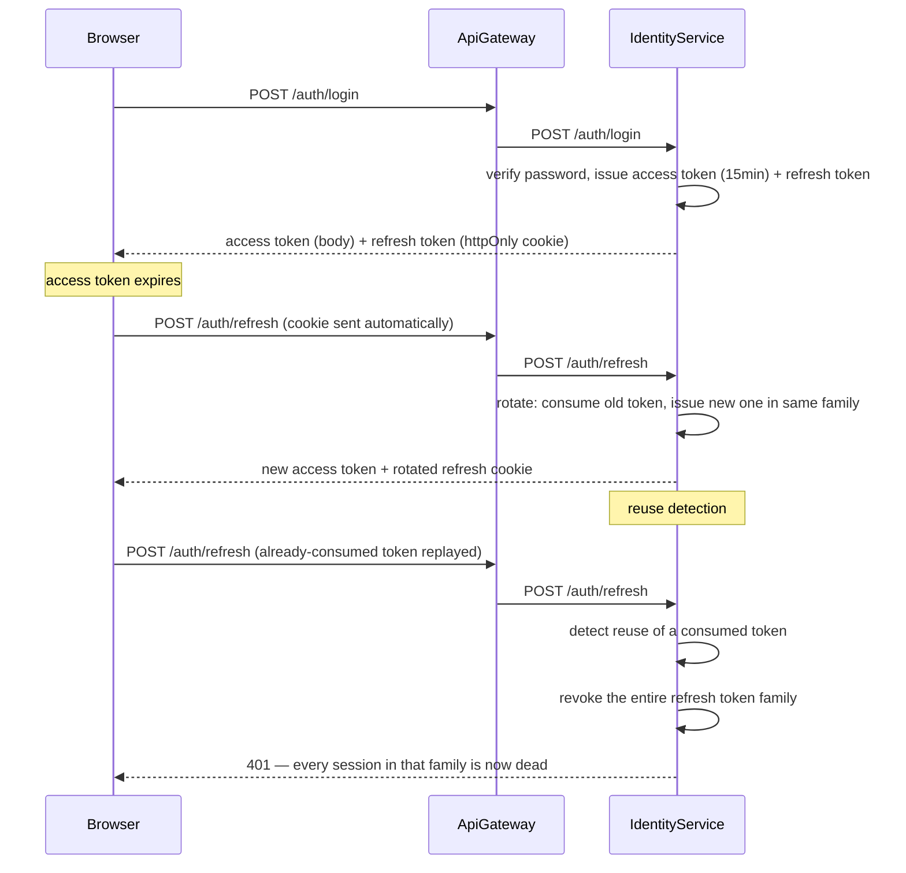
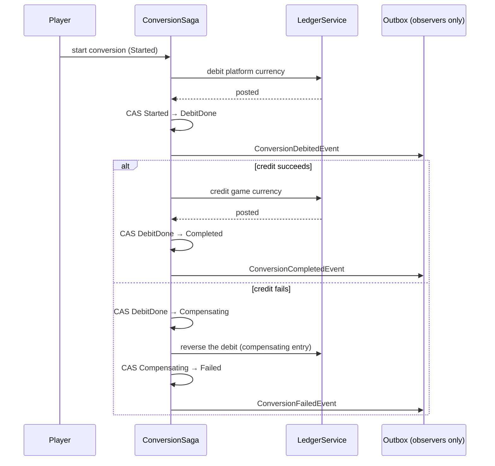
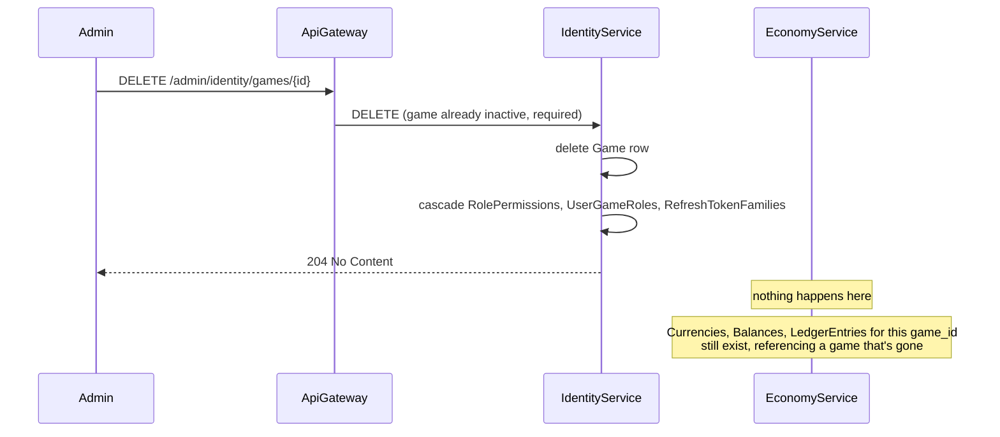
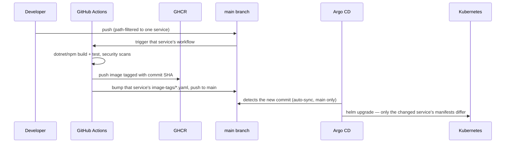

# Business and technical flows

Flows chosen to show real architectural complexity — a synchronous request continuing into an async
event, a saga with compensation, a documented cross-service consistency gap — not an exhaustive
endpoint-by-endpoint walkthrough. Every diagram reflects the actual code path, not an idealized one.

## Registration, email confirmation, and the welcome grant

The clearest example of a request crossing from synchronous to asynchronous and back into a second
service. See [Data ownership](data.md#what-crossing-the-boundary-costs) for why this can't be one
transaction.

The player's starting currency doesn't exist at the moment `confirm-email` returns 200 — it exists
once the outbox dispatcher's next poll cycle publishes the event and EconomyService's consumer
processes it, typically within one poll interval. A client refreshing its balance right after
confirming may briefly see nothing, which is why player-client's Shell also reconciles via the
SignalR `balanceChanged` push once it arrives rather than assuming the grant already landed.

## Login and token refresh

A presented refresh token that's already been consumed doesn't just fail — it revokes every token in
that family, on the theory that a consumed token being replayed means it was stolen and used by
someone else first. See [ADR 0008](../adr/0008-token-strategy.md).

## Currency conversion saga

In-process and sequential, not choreography over the message bus — both currencies involved belong
to EconomyService itself, so there's no second service to react to an event mid-saga. Each transition
commits on its own and is guarded by a compare-and-swap on the conversion's own status column, so a
crash mid-saga leaves a durable, unambiguous record of exactly which step was reached.

The outbox events in this flow are for observers (Wallet's history pairing, a deduplicating
consumer) — they never drive the saga's own next step. A player can also cancel a conversion still
`Started` or `DebitDone`; cancellation reuses the same compensating path rather than a second copy of
the reversal logic.

## Game hard-delete: a documented consistency gap

Not a happy-path flow — included because it's the sharpest concrete illustration of what
database-per-service costs without a compensating event. See
[ADR 0026](../adr/0026-game-hard-delete-orphaned-economy-data.md) for the full trade-off.

Nothing publishes an event on delete today — IdentityService's own tables cascade cleanly, but
EconomyService is never told the game is gone. The fix that would close this
(`GameDeleted` on the same outbox pipeline the welcome grant already uses) is named in ADR 0026 as a
real, not-yet-built follow-up.

## CI, GitOps, and deployment

A fresh image landing in GHCR changes nothing by itself — Argo CD reacts to the image-tag commit, not
the registry push. See [GitOps and CI/CD](../operations/gitops.md) and
[ADR 0023](../adr/0023-gitops-argocd.md).

## Related documentation

- [Data ownership](data.md)
- [Backend deployment topology](backend.md)
- [ADR 0008: Token strategy](../adr/0008-token-strategy.md)
- [ADR 0010: Transactional outbox](../adr/0010-transactional-outbox-event-bus.md)
- [ADR 0023: GitOps with Argo CD](../adr/0023-gitops-argocd.md)
- [ADR 0026: Game hard-delete](../adr/0026-game-hard-delete-orphaned-economy-data.md)
