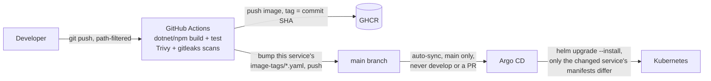

# GitOps and CI/CD

A fresh image landing in GHCR changes nothing on its own — Argo CD reacts to the image-tag bump
commit reaching `main`, not the registry push.

## CD

Argo CD watches `main` and auto-syncs the Helm chart from
[`infra/helm/gaming-backend-platform/`](../../infra/helm/gaming-backend-platform/) — see
[`scripts/k8s/argocd-application-production.yaml`](../../scripts/k8s/argocd-application-production.yaml)
for the `Application` itself. It only reacts to `main`, never `develop` or an open PR, and only to an
actual git commit — a fresh image landing in GHCR under the same tag changes nothing about the
rendered manifest on its own.

Each service's own CI workflow ends by pointing that service's `imageTag` — in its own file under
[`image-tags/`](../../infra/helm/gaming-backend-platform/image-tags/), since CI is path-filtered and a
shared tag would have every service pull an image that was never rebuilt for it — at the commit SHA
it just built, then pushes that change back to `main`, the commit Argo CD's sync actually reacts to.
A push touching only `EconomyService` therefore redeploys exactly `economy-service` (and
`economy-migrator`), not the other seven images sitting untouched. Full reasoning, including two real
RBAC incidents this setup uncovered, in [ADR 0023](../adr/0023-gitops-argocd.md).

## CI

| Workflow | Triggers on | Checks |
|---|---|---|
| [identity-ci](../../.github/workflows/identity-ci.yml) | `backend/IdentityService/**`, `backend/IdentityService.Tests/**`, `backend/Directory.*.props`, `global.json` | `dotnet build` + `dotnet test`, then pushes `identity-service` to GHCR |
| [gateway-ci](../../.github/workflows/gateway-ci.yml) | `backend/ApiGateway/**`, `backend/ApiGateway.Tests/**`, `backend/Directory.*.props`, `global.json` | `dotnet build` + `dotnet test`, then pushes `api-gateway` to GHCR |
| [economy-ci](../../.github/workflows/economy-ci.yml) | `backend/EconomyService/**`, `backend/EconomyService.Tests/**`, `backend/Directory.*.props`, `global.json` | `dotnet build` + `dotnet test`, Trivy filesystem scan, pushes `economy-service` to GHCR, then Trivy image scan |
| [platform-worker-ci](../../.github/workflows/platform-worker-ci.yml) | `backend/Platform.Worker/**`, `backend/Platform.Worker.Tests/**`, `backend/Directory.*.props`, `global.json` | same shape as `economy-ci`, scoped to `platform-worker` |
| [notification-ci](../../.github/workflows/notification-ci.yml) | `backend/NotificationService/**`, `backend/NotificationService.Tests/**`, `backend/BuildingBlocks.Messaging/**`, `backend/Directory.*.props`, `global.json` | same shape as `economy-ci`, scoped to `notification-service` |
| [email-service-ci](../../.github/workflows/email-service-ci.yml) | `backend/EmailService/**`, `backend/EmailService.Tests/**`, `backend/Directory.*.props`, `global.json` | same shape as `economy-ci`, scoped to `email-service` |
| [player-client-ci](../../.github/workflows/player-client-ci.yml) | `frontend/**` | Node 22, `npm ci` + `npm run build` + `npm run test` (Vitest), Trivy filesystem scan, pushes `player-client` to GHCR, then Trivy image scan |
| [admin-client-ci](../../.github/workflows/admin-client-ci.yml) | `frontend/**` | Same shape as `player-client-ci`, scoped to `admin-client` |
| [k8s-validate](../../.github/workflows/k8s-validate.yml) | `infra/helm/**`, `backend/ApiGateway/ocelot*.json`, `backend/EmailService/Templates/**`, `infra/{otel-collector,tempo,prometheus,loki,grafana}/**` | renders the Helm chart (mirroring `scripts/k8s/apply.sh`'s value files and `--set-file` flags exactly) and validates it with `kubeconform` |
| [gitleaks](../../.github/workflows/gitleaks.yml) | every push/PR to `main`/`develop`, whole repository | scans the full git history (not just the diff) for committed secrets |

Path filters mean touching `backend/EconomyService/` doesn't trigger `identity-ci`, and vice versa —
each service only rebuilds and retests on the changes that could actually affect it.

**Gitleaks results don't go to the Security tab.** It's a job-summary/PR-comment report instead, on
purpose: gitleaks scans the whole git history, so a hit means the secret is sitting in some past
commit, not just the working tree. A Security tab alert reads as "fix the code, dismiss the alert" —
the actual fix here is rotating the leaked credential, which no code change accomplishes, so routing
it through the same UI as a code-scanning finding would be misleading.

**Trivy results do go to the Security tab** — both the dependency scan and the image scan upload
SARIF via `github/codeql-action/upload-sarif`. There's no standalone `trivy` badge above because
Trivy isn't its own workflow: it runs as a step inside `economy-ci`, `platform-worker-ci` and
`player-client-ci` (`.github/actions/trivy-scan`), right after each one pushes its image, so what
gets scanned is the image that would actually reach the cluster.

## Rollback

No dedicated rollback workflow exists. Argo CD's own `argocd app rollback` (or re-syncing to a prior
`main` commit) is the mechanism today — reverting the image-tag bump commit and letting the normal
sync pick it up works identically to a purpose-built rollback path, since the tag bump *is* the
deployment trigger. **Known limitation:** this hasn't been exercised for real yet; it's an inferred
capability from how the pipeline is built, not a documented, tested procedure.

## Related documentation

- [ADR 0021: Kubernetes/Helm migration](../adr/0021-kubernetes-helm-migration.md)
- [ADR 0023: GitOps with Argo CD](../adr/0023-gitops-argocd.md)
- [Deployment](deployment.md)
- [Backend deployment topology](../architecture/backend.md)
